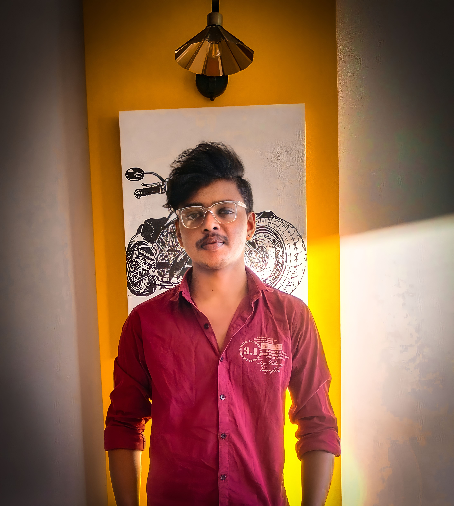
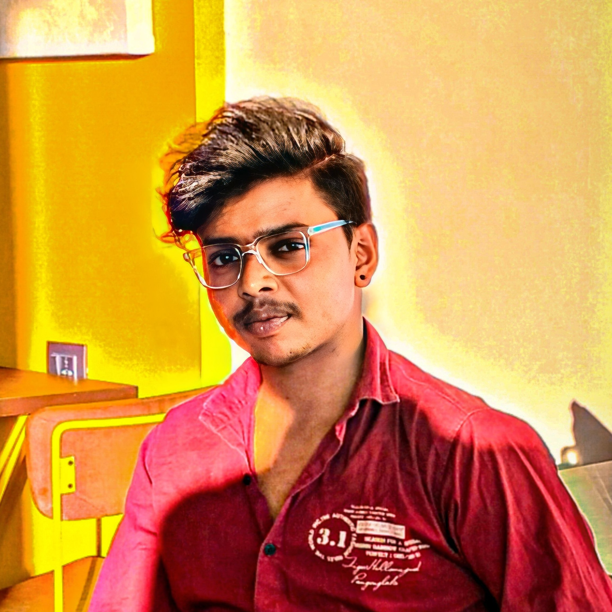

<!DOCTYPE html>
<html lang="en">
<head>
    <meta charset="UTF-8">
    <meta name="viewport" content="width=device-width, initial-scale=1.0">
    <title>Nagendra Kumar</title>
    <link rel="stylesheet" href="myprofile.css">
    <link rel="stylesheet" href="myprofile.js">
    <link href='https://unpkg.com/boxicons@2.1.4/css/boxicons.min.css' rel='stylesheet'>
    
</head>
<body>
    <!-- Navbar -->
    <header>
    <a href="#" class="logo">Nagendra Kumar</a>
    <ul class="navbar">
        <li><a href="#home">Home</a></li>
        <li><a href="#About">About</a></li>
        <li><a href="#Skills">Skills</a></li>
        <li><a href="#Services">Services</a></li>
        <li><a href="#Portfolio">Portfolio</a></li>
        <li><a href="#Contact">Contact</a></li>
        <li><i class='bx bx-moon'></i></li> 
        <i class='bx bxs-sun'></i>
    </ul>
    </header>

    <!--Home Page-->
    <section id="home">
        
          
            <a href="https://github.com/nani6309/portfolio.git" target="_blank"><i class='bx bxl-github'></i></a>
            <a href=""><i class='bx bxl-instagram' ></i></a>
            <a href="https://www.linkedin.com/in/nagendra-nani-b68565221/" target="_blank"><i class='bx bxl-linkedin' ></i></a>
        

        
      
            Hello, Iam
            <h1>Nagendra Kumar</h1>
            <h2>Full Stack Developer</h2>
            
Motivated and dedicated Python developer with a strong
                foundation in programming principles. Skilled in Python and
                SQL, HTML and CSS, JavaScript, Django, Git,Github.

            <input class="but" type="button" value="Contact Me">
        

        
    
            
        

    </section>
    <!-- About -->
    <section class="About" id="About">
        

            <h1>About</h1>
            Introduction
        

        
    

        
Lorem ipsum dolor sit amet consectetur adipisicing elit. Error voluptates consequatur sequi quasi laboriosam cupiditate repellat praesentium libero et animi? Eius adipisci officiis quaerat maiores ex veniam tempora rem in.

    

        <a href="#nameicon"><i class='bx bxs-user'></i>    Nagendra Kumar</a>
        <a href="#phoneicon"><i class='bx bxs-phone-call'></i>    +91 7095880269</a>
        <a href="emailicon"><i class='bx bxl-gmail' ></i>    nagvenky57@gmail.com</a>
    

    <a class="butt" href="./nagendrakumar7095.pdf" target="_blank">Resume</a> 
    

    </section>
    <!-- Skills -->
<section class="skills" id="Skills">
    

        <h1>Skills</h1>
        My Skills    
    

    

        <h4>Python</h4>
        <h5>80%</h5>
    

    

        

        

    
 
    

        <h4>SQL</h4>
        <h5>90%</h5>
    

    

        

        

    
 
    

        <h4>Git & Github</h4>
        <h5>90%</h5>
    

    

        

        

    
 
    

        <h4>HTML & CSS</h4>
        <h5>80%</h5>
    

    

        

        

    
 
    

        <h4>Django</h4>
        <h5>80%</h5>
    

    

        

        

    

    

    

    
    

<section>
<!-- Serices -->
<section class="services" id="Services">
    

        <h1>Services</h1>
        Our Services
    

    

        <i class="bx bx-code-alt"></i>
        <h3>Web Development</h3>
        <a href="#">Learn More</a>
    

    

        <i class="bx bx-server"></i>
        <h3>Backend Development</h3>
        <a href="#">Learn More</a>
    

    

        <i class="bx bxl-django"></i>
        <h3>Django</h3>
        <a href="#">Learn More</a>
    

    

        <i class='bx bxl-github' ></i>
        <h3>Git Bash & Git Hub</h3>
        <a href="#">Learn More</a>
    

</section>
<!-- Portfolio -->
<section id="Portfolio">
    

      <h1>Portfolio</h1>
      Our Recent Work
    

    

        

            
        

        

            
        

        

            
        

        

            
        

        

            
        

        

            
        

    

</section> 
<!-- Contact -->
<section id="Contact">
    

        <h1>Contact</h1>
        Connect With Me
    

    

        <form class="input-form">
            <input type="text" placeholder="Your Name">
            <input type="email" name="" id="" placeholder="Your Email">
            <textarea placeholder="Write Message Here......"></textarea>
            <input class="button" type="button" value="Send">
        </form>

    

</section>
<!-- footer -->

     <h2>Nagendra Kumar</h2>

    <a href="https://github.com/nani6309/python-projects.git" target="_blank">
        <i class='bx bxl-github'></i>
    </a>     
    <a href="https://www.linkedin.com/in/nagendra-nani-b68565221/" target="_blank">
        <i class='bx bxl-linkedin' ></i>
    </a>  

      
All Rights are Reserved.

</body>
</html>

@import url('https://fonts.googleapis.com/css2?family=Poppins:wght@400;600&display=swap');
*{
    margin: 0;
    padding: 0;
    font-family: "poppins", sans-serif;
    list-style: none;
    text-decoration: none;
    box-sizing: border-box;
    scroll-behavior: smooth;
    scroll-padding-top: 2rem;
}
:root{
    --main-color:#033a80;
    --bg-color:#fff;
    --text-color:#0f0c27;
    --hover-color:#5805ff;
    --big-font:3.2rem;
    --medium-font:1.8rem;
    --p-font:0.941rem;
}
body{
    background-color: var(--bg-color);
    color: var(--text-color);
}
body.active{
    --bg-color:#0f0c27;
    --text-color:#fff;
}
header{
    position: fixed;
    width: 100%;
    display: flex;
    justify-content: space-between;
    align-items: center;
    padding: 13px 10%;
    background-color: var(--bg-color);
    z-index: 1000;
    box-shadow: rgba(0, 0, 0, 0.25) 0px 54px 55px, rgba(0, 0, 0, 0.12) 0px -12px 30px, rgba(0, 0, 0, 0.12) 0px 4px 6px, rgba(0, 0, 0, 0.17) 0px 12px 13px, rgba(0, 0, 0, 0.09) 0px -3px 5px;
}
header.shadow{
    box-shadow: 0 0 4px rgb(14 55 54 / 15%);
}
.logo{
    font-size: 1rem;
    font-weight: 600;
    color: var(--text-color);
}
.navbar{
    display: flex;
}
.navbar a{
    font-size: 1rem;
    padding: 10px 20px;
    font-weight: 500;
    color: var(--text-color);
}
.navbar a:hover{
    color: var(--hover-color);
}
.navbar .bx{
    font-size: 22px;
    cursor: pointer;
}
/* home */
section{
    padding: 50px 10%;
}
#home{
    display: grid;
    grid-template-columns: 0.5fr 1fr 1fr;
    align-items: center;
    gap: 3rem;
    height: 100vh;
}
.social{
    display: flex;
    flex-direction: column;
    padding-bottom: 6.5rem;
    padding-left: 10rem;
}
.social a{
    font-size: 40px;
    color: var(--text-color);
    display: flex;
    margin-bottom: 3.5rem;
}
.home-text{
    padding-left: 0rem;
    padding-bottom: 4rem;
}
.home-text span{
    font-size: var(--medium-font);
}
.home-text h1{
    font-size: var(--big-font);
    margin-bottom: 1rem;
}
.home-text h2{
    font-size: 20px;
    font-weight: 100;
    margin-bottom: 1rem;
}
.but{
    background-color: blue;
    margin-top: 1rem;
    color: var(--bg-color);
    display: inline-block;
    padding: 0.7rem 1.3rem;
    border-radius: 0.5rem;
}
.butt{
    background-color: blue;
    width: 6.5rem;
    padding: 0.7rem 1.3rem;
    border-radius: 0.5rem;
    color: var(--bg-color);
}
.Image{
    display: flex;
    margin-left: 8rem;
    margin-bottom: 3rem;
    filter: drop-shadow(10px 7px 20px black);
}
/* About */
#About-1{
    display: grid;
    grid-template-columns: 1fr 1fr;
}
.about-icon{
    display: grid;
    grid-template-rows: 3rem 3rem 3rem;
}
.about-content p{
    margin-bottom: 2rem;
    margin-top: 3rem;
}
.header h1{
    display: flex;
    justify-content: center;
    font-weight: 900;
    font-size: 30px;
}
.header span{
    display: flex;
    justify-content: center;
    color: aquamarine;
}
#About-1 img{
    margin-top: 2rem;
    margin-left: 5rem;
    filter: drop-shadow(10px 7px 20px black);
}
.about-icon input{
    width: 100px;
    background-color: blue;
    margin-top: 1rem;
    color: var(--bg-color);
    display: inline-block;
    padding: 0.7rem 1.3rem;
    border-radius: 0.5rem;
}
.about-icon a{
    color: var(--text-color);
    display: flex;
}
.about-icon i{
    font-size: 25px;
    margin-right: 1rem;
}
/* skills */
.skill-1{
    display: flex;
    align-items: center;
}
.skill-1 h4{
    margin-right: 19.3rem;
}
.percentage-below-skill-1{
    background-color: violet;
    height: 1rem;
    width: 400px;
    border-radius: 1rem;
}
.percentage-above-skill-1{
    background-color: darkmagenta;
    height: 1rem;
    width: 335px;
    border-radius: 1rem;
}
.skill-2{
    display: flex;
    align-items: center;
}
.skill-2 h4{
    margin-right: 21rem;
}
.percentage-below-skill-2{
    background-color: violet;
    height: 1rem;
    width: 400px;
    border-radius: 1rem;
}
.percentage-above-skill-2{
    background-color: darkmagenta;
    height: 1rem;
    width: 350px;
    border-radius: 1rem;
}
.skill-3{
    display: flex;
    align-items: center;
}
.skill-3 h4{
    margin-right: 16.8rem;
}
.percentage-below-skill-3{
    background-color: violet;
    height: 1rem;
    width: 400px;
    border-radius: 1rem;
}
.percentage-above-skill-3{
    background-color: darkmagenta;
    height: 1rem;
    width: 350px;
    border-radius: 1rem;
}
.skill-4{
    display: flex;
    align-items: center;
}
.skill-4 h4{
    margin-right: 17rem;
}
.percentage-below-skill-4{
    background-color: violet;
    height: 1rem;
    width: 400px;
    border-radius: 1rem;
}
.percentage-above-skill-4{
    background-color: darkmagenta;
    height: 1rem;
    width: 335px;
    border-radius: 1rem;
}
.percentage-below-skill-5{
    background-color: violet;
    height: 1rem;
    width: 400px;
    border-radius: 1rem;
}
.percentage-above-skill-5{
    background-color: darkmagenta;
    height: 1rem;
    width: 335px;
    border-radius: 1rem;
}
.skill-5{
    display: flex;
    align-items: center;
}
.skill-5 h4{
    margin-right: 19.2rem;
}
.img-skill img{
    margin-left: 38rem;
    margin-top: -20rem;
    box-shadow: 10px 7px 20px black;
}
.skill-content-img{
    margin-left: 6rem;
    margin-top: 2rem;
}
/* services */
.Services-content{
    display: grid;
    grid-template-columns: 40% 40% 40% 40%;
    gap: 1rem;
    justify-content: center;
    margin-top: 3rem;
}
.Services-box{
    display: flex;
    flex-direction: column;
    align-items: center;
    padding: 20px;
    width: 280px;
    box-shadow: 0 2px 7px rgb(14 55 54 / 15%);
    border-bottom: 2px solid var(--main-color);
    border-radius: 0.5rem;
}
.Services-box:hover{
    background-color: #02225a;
}
.Services-box h3{
    font-size: 1rem;
    font-weight: 600;
    margin: 0.7rem 0 0.4rem;
}
.Services-box:hover h3{
    color: #fff;
}
.Services-box .bx{
    font-size: 54px;
    color: var(--main-color);
}
.Services-box:hover .bx{
    color: #22cf91;
}
.Services-box a{
    color: var(--main-color);
    font-size: var(--p-font);
    font-weight: 500;
}
.Services-box:hover a{
    color: #8b8a8f;
}
/* portfolio */
.Portfolio-content{
    display: grid;
    grid-template-columns: 400px 400px 400px;
    gap: 1rem;
    margin-top: 2rem;
    justify-content: center;
    margin-left: 7rem;
}
.portfolio-img img{
    overflow: hidden;
    border-radius: 0.5rem;
    filter: drop-shadow(10px 7px 10px black);
}
   
.portfolio-img img{
    width: 90%;
    display: block;
}
.portfolio-img img:hover{
    transform: scale(1.1);
    transition: 1s;
}
.contact-form {
    display: grid;
    place-items: center;
    margin-top: 2rem;
  }
  
  .contact-form form {
    display: flex;
    flex-direction: column;
    width: 650px;
  }
  
  form input,
  textarea {
    padding: 15px;
    border-radius: 0.5rem;
    border: none;
    outline: none;
    background: hsla(260, 100%, 44%, 0.1);
    margin-bottom: 1rem;
    color: var(--text-color);
  }
  
  form input::placeholder,
  textarea::placeholder {
    color: var(--text-color);
  }
  
  form textarea {
    resize: none;
    height: 200px;
  }
  
  form .button {
    align-self: center;
    background-color: #5805ff;
    color: var(--bg-color);
  }
  /* footer */
  .footer {
    display: grid;
    place-items: center;
    padding: 30px;
    background: #ebebeb;
    width: 158%;
    color: #000;
    margin-left: -17rem;
  }
  .footer h2 {
    font-size: 1.5rem;
  }
  .footer-social{
    background: #ebebeb;
    margin-left: -17rem;
    width: 158%;
    padding-left: 36rem;
}
.footer-social a i {
    color: rgb(10, 26, 208);
    font-size: 50px;
    border-radius: 50%;
    margin-left: 5.6rem;
}
/* copyright */
.copyright {
    padding: 20px;
    background: var(--main-color);
    text-align: center;
    color: #fff;
    width: 171%;
    margin-left: -21rem;
    margin-bottom: -10rem
  }

 
  /* Base styles for the body */
/* body {
    font-family: Arial, sans-serif;
    font-size: 16px;
    line-height: 1.5;
    margin: 0;
    padding: 0;
} */

/* Responsive styles for the body */
@media only screen and (max-width: 768px) {
    body {
        font-size: 14px;
    }
}

@media only screen and (max-width: 576px) {
    body {
        font-size: 12px;
    }
}

  
